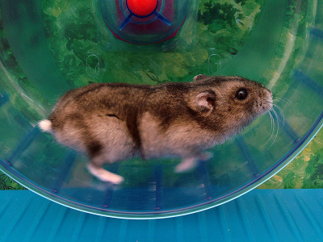

# About {{ site.designation }}

*{{site.title}}* is about the stuff inside the processor. No matter what I say all term, this is the truth about what is inside your computer:

  <small>
    
</small>

**Honest**.

In this course, we use *The Elements of Computing Systems* to build a computer. We start with the NAND (or NOT AND) gate, and from there build a CPU. It will be a simple CPU (the authors call it the "Hack CPU"), and it will be in emulation only, but that's still pretty good.

Because I think real hardware is important, we'll deviate from the text somewhat. Once we learn how to translate an "intermediate language" into the assembly language of the Hack CPU, we'll then write a VM in C++ that can execute that language directly. We'll then pull out our trusty Arduino and run our VM on real hardware. For fun, we'll extend the VM with some memory-mapped segments so that we can control the hardware directly from our virtual machine's intermediate language.

Finally, we'll go back to our translator, and instead of translating our intermediate language into Hack Assembly, we'll instead translate it into assembly that can be executed directly on the Arduino.

In every case, these "translators" are essentially small *compilers*, which are programs that transform one language into another.